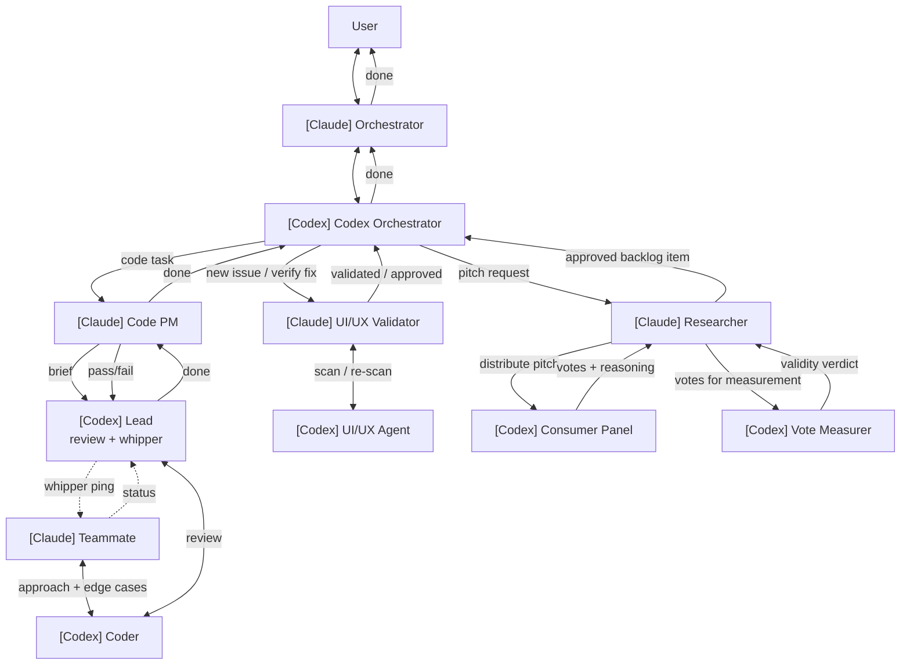

# Orchestration Contract

This is the operating model for AI agents working in this repo.
Every agent — present or future — must follow this contract.
Drift is not silent: violations get called out and corrected.

## The bipartite parity rule

**Every parent–child agent edge must cross parity (Claude ↔ Codex).**
No Claude→Claude, no Codex→Codex. Every agent knows its work will be reviewed by an agent of the
opposite type, which keeps both honest by construction.

Two anchors are fixed:
- Top of the tree: **Orchestrator = Claude** (talks to user).
- Deepest agent that touches code: **Coder = Codex**.

Everything else is derived from those two anchors plus the parity rule.

## The graph

```
[Claude] User
   │
[Claude] Orchestrator           → roles/ORCHESTRATOR.md
   │
[Codex]  Codex Orchestrator     → roles/CODEX_ORCHESTRATOR.md (persistent, pool manager)
   │
   ├── [Claude] Code PM         → roles/CODE_PM.md (per stream)
   │      │
   │      └── [Codex] Code Lead → roles/CODE_LEAD.md (per stream, reviewer + whipper)
   │             │
   │             └── [Claude] Teammate → roles/TEAMMATE.md (per commit)
   │                    │
   │                    └── [Codex] Coder → roles/CODER.md (per commit)
   │
   ├── [Claude] UI/UX Validator → roles/UI_UX_VALIDATOR.md (per issue, also re-verifies fix)
   │      │
   │      └── [Codex] UI/UX Agent → roles/UI_UX_AGENT.md (on-demand + post-commit)
   │
   └── [Claude] Researcher      → roles/RESEARCHER.md (heads research pipeline)
          │
          ├── [Codex] Consumer Panel → roles/CONSUMER.md (N=5 personas)
          └── [Codex] Vote Measurer  → roles/VOTE_MEASURER.md (weighted score + cited evidence)
```

## Three streams, all routed through Codex Orchestrator



## Locked global rules

### Lifecycle / pool
- **Codex Orchestrator** is **persistent** across user requests. It tracks all in-flight streams,
  knows the PM/Lead pool, decides whether to spawn a new PM or reuse a freed one, reassigns
  freed agents to incoming work.
- **Code PM**: per stream. A "stream" = a coherent goal (e.g. "UI accessibility fixes" → many
  commits). PM lives stream-long; on stream close, returns to Codex Orch's pool.
- **Code Lead**: per stream. Same lifetime as PM. Reviews discipline + whipper cadence stays
  consistent across the stream's commits.
- **Teammate + Coder**: per commit. Each atomic commit gets a fresh pair; insulates against
  Codex silent-failure modes and avoids stale design context bleeding across commits.
- **Pool ceiling**: max **5 PMs + 5 Leads in flight**. Above ceiling, Codex Orch queues new
  streams. Prevents "20 streams in flight, none making progress."

### Whipper cadence (Code Lead pings team)
- 1 min for tiny fixes (<10 lines).
- 2 min default (typical fix, 10–60 lines).
- 5 min for large work (≥200 lines, schema changes).
- **Hard rule: > 4 min of silence triggers Lead escalation to PM**, regardless of nominal cadence.
  Catches the "Codex ran 21 min and produced nothing" failure mode.

### Consumer Panel
- **N = 5** Codex agents, fixed.
- Researcher picks the 5 personas most relevant to the pitch.

### Vote Measurer pass criteria (BOTH must hold)
1. Weighted score ≥ 3.0:
   `Strong yes = +1.5`, `Yes = +1`, `Mixed = +0.5`, `Weak = 0`, `No-go = -1`.
2. At least 2 voters cite specific evidence (file:line, schema field, competitor URL).

### UI/UX Agent cadence
- Triggered on user request ("audit the editor").
- Auto-triggered after every code commit that touches UI files.
- NOT a continuous background watcher.

## Harness constraints (real, verified — workarounds in role files)

These are NOT bugs. Working around them is the orchestrator's job.

1. **Subagents cannot spawn other agents.** Only the top-level Orchestrator can spawn.
   PM/Lead/etc. return decisions and briefs as text; Orchestrator executes the spawns.
2. **Subagents cannot SendMessage each other.** Orchestrator sequences the dialog by relaying
   outputs (Claude design → Codex implement → Claude review).
3. **Codex sandbox blocks `.git/` writes** (case-mismatch on writable-roots: `/users/` lowercase
   in sandbox vs `/Users/` actual). Codex never runs git. Orchestrator does branch creation,
   `git add`, `git commit`, tags.
4. **Codex sandbox blocks localhost network.** Brief Codex to skip localhost-dependent test
   commands (e.g., `pnpm test` chains a Vite-localhost gate); orchestrator runs those separately.
5. **One worktree, one HEAD.** Two Codex agents on different branches cannot run simultaneously
   in the same worktree. Use `git worktree add` for true parallelism, or serialize per branch.
6. **Codex CLI rate limit.** Manifests as either an explicit error message OR a silent run
   producing only startup lines. Detect by inspecting working tree post-return; retry once;
   if still empty, escalate to user.
7. **Standalone `codex exec` from raw Bash is flaky** — use `codex:codex-rescue` subagent type
   only.

## Failure modes

| Failure | Detection | Recovery |
|---|---|---|
| Codex returns empty | `git diff` shows no change | Retry once with sharper brief; if still empty, escalate |
| Codex sandbox blocks `.git/` | EPERM in output | Orchestrator handles git; brief Codex to skip |
| Codex sandbox blocks localhost | EPERM on `urlopen` | Brief explicit non-localhost test command |
| Codex hits rate limit | Error OR silent empty return | Queue Claude planning; resume after reset |
| Codex Coder silent > 4 min | Lead's whipper ping unanswered for one cycle | Lead escalates to PM; PM decides retry/abort |
| Pair-model violation | Reviewer step skipped on a commit | Retroactive reviewer audit on the commit range |
| Working tree dirty conflict | `git status` shows modified scoped files | Park to feature branch before starting new task |
| Two Codex on same branch | Diff corruption | Always serialize per branch |

## Decision rules for the (Claude) Orchestrator

1. **Goal: answer the user at any time, instantly.** Never tool-stuck.
2. **Decide and act when sure.** Don't bounce trivial sequencing back to user.
3. **Parallel by default.** Independent work spawns in the same turn.
4. **Spawn a Claude reviewer when unsure.** Non-obvious decisions go through an independent
   review. Bring a recommendation, not a menu.
5. **Decisions about user state are always asked.** Parking WIP, dropping uncommitted work,
   force-pushing — never decide alone.

## Communication cadence (orchestrator → user)

- Surface only meaningful progress: commits landed, blockers, decisions needing input.
- Heartbeat updates ("agent X still running") add noise. Don't send.
- "Status" / "progress" requests get a structured snapshot, not narration.
- When user calls out a problem, own it, fix it, add a rule to this document so the next
  session doesn't repeat the mistake.

## Adding new rules

Discovered a new harness constraint, failure mode, or operating rule? Add it here. Bipartite
parity, locked global rules, and harness constraints are amended in this file; per-role
behavior in the role file under `roles/`.

Silent drift is the failure mode this document exists to prevent.
