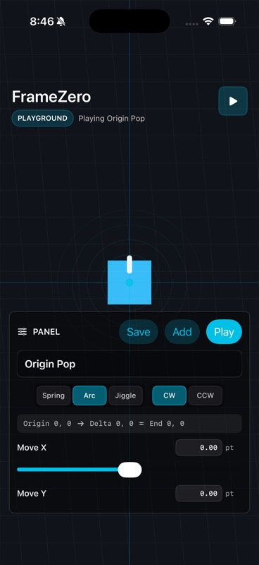

# FrameZero

Design complex SwiftUI animations in a playground. Ship them as JSON.

FrameZero is a SwiftUI motion engine and animation playground for making complex motion easier to create, tweak, and reuse.

The idea is simple: animation should not be trapped inside hard-coded Swift. Open the playground, tweak motion with controls, build phases, play the full sequence, then use the generated JSON in your app.

<p align="center">
  
</p>

> Current Swift package module name: `MotionEngineKit`.

## What It Can Do For You

FrameZero lets you describe motion in JSON instead of hard-coding every animation in Swift.

You can:

- Render a JSON-defined SwiftUI scene.
- Animate existing SwiftUI views with `.motionDriven(...)`.
- Build motion as named phases.
- Chain phases into a single animation.
- Tweak movement, arc, rotation, scale, opacity, response, damping, duration, and delay from a control panel.
- Use screen and safe-area metrics in JSON.
- Use spring, timed, arc, jiggle, drag, slingshot, and projectile-style motion.
- Keep animation behavior outside app code so it can be changed later.

## Why It Feels Different

FrameZero treats motion as data.

Instead of writing one-off animation code, you create reusable motion blocks. Each phase starts from the previous phase endpoint, so complex animation becomes a sequence of small, understandable moves.

The control panel is the authoring loop:

1. Create or tune animation in the sample app.
2. Adjust values until it feels right.
3. Save the motion as a phase.
4. Chain phases into one animation.
5. Use the JSON in the runtime.

Creating complex animation is simpler than you think: tweak the behavior, get the JSON, and let the engine run it.

## Quick Start

1. Open `AnimationEngine.xcodeproj`.
2. Run the `AnimationEngine` sample app.
3. Use the playground control panel to create a phase.
4. Tap `Add` to add it to the animation timeline.
5. Tap `Play Animation` to preview the full sequence.
6. Reuse the same JSON structure in your app with `MotionRuntimeView` or `.motionDriven(...)`.

## Why This Exists

Most app animations become hard-coded quickly. Once that happens, changing motion requires editing Swift code, rebuilding the app, and shipping a new version.

FrameZero treats motion as configuration.

That means a designer, developer, tool, or eventually a Mac editor can produce animation JSON, and the iOS runtime can execute it natively.

The long-term idea is a creative motion tool for apps: build alive, game-like, physics-based UI interactions without rewriting animation code every time.

## Current Support

### Scene Nodes

The JSON renderer currently supports a small SwiftUI node set:

- `zstack`
- `vstack`
- `hstack`
- `text`
- `circle`
- `roundedRectangle`

Each node can define:

- `id`
- `kind`
- `roles`
- `layout`
- `style`
- `presentation`
- `children`
- optional state-machine `presence`

### Animated Properties

The engine supports scalar animation channels such as:

- `offset.x`
- `offset.y`
- `rotation`
- `scale`
- `scale.x`
- `scale.y`
- `opacity`

Uniform `scale` can be combined with `scale.x` and `scale.y` for stretch effects.

### Motion Rules

Supported motion types:

- `spring`: response + damping driven motion.
- `timed`: duration-based interpolation with easing.
- `immediate`: snap to target.

Supported timed easing values:

- `linear`
- `easeIn`
- `easeOut`
- `easeInOut`

### Transition Effects

Supported transition helpers:

- `arcs`: move a node along an arc between two channel targets.
- `jiggles`: rapid oscillation, useful for panic/shake/fear-style effects.
- `delay`: explicit transition delay.
- rule-level `delay`: delay a specific property target.

Arc direction supports:

- `clockwise`
- `anticlockwise`

### Timeline Phases

The sample playground supports phase-based authoring.

Important concepts:

- `Move X/Y` are local deltas from the current phase origin.
- The end of one phase becomes the origin of the next phase.
- `Phase Duration` controls when the next phase starts.
- `Start Delay` adds optional wait before a phase.
- `Response` controls spring feel, not sequencing.
- `Damping` controls how much the spring bounces or settles.

So:

```json
"response": 0.45
```

means "how the motion feels."

```json
"phaseDuration": 0.35
```

means "when the next phase should begin."

### Screen And Safe-Area Metrics

JSON values can be relative to the viewport:

- `screen.width`
- `screen.height`
- `screen.left`
- `screen.right`
- `screen.top`
- `screen.bottom`
- `screen.centerX`
- `screen.centerY`
- `safeArea.width`
- `safeArea.height`
- `safeArea.left`
- `safeArea.right`
- `safeArea.top`
- `safeArea.bottom`
- `safeArea.centerX`
- `safeArea.centerY`

Example:

```json
{
  "metric": "safeArea.centerX",
  "offset": 40
}
```

### Gestures And Physics

The current engine includes early support for:

- tap triggers
- drag bindings
- slingshot-style drag interactions
- projectile launch
- gravity
- wind or constant force
- screen-bound and safe-area-bound collisions
- restitution, friction, air resistance, stop speed
- charge glow and trajectory preview rendering

This is the beginning of the "game-feel" layer.

## Use It In SwiftUI

### Render A JSON Scene

```swift
import SwiftUI
import MotionEngineKit

struct DemoView: View {
    @State private var frame = 0
    private let engine = MotionEngine()

    var body: some View {
        ZStack {
            MotionRuntimeView(engine: engine, frame: frame)
            MotionEffectsOverlay(engine: engine, frame: frame)
        }
        .background {
            DisplayLinkTicker { dt in
                if engine.tick(dt: dt) {
                    frame += 1
                }
            }
        }
        .onAppear {
            try? engine.load(fileURL: Bundle.main.url(forResource: "Demo", withExtension: "motion.json")!)
        }
    }
}
```

### Animate Any SwiftUI View

You do not have to let JSON create the view. You can keep your own SwiftUI and let JSON drive its motion.

```swift
Circle()
    .fill(.cyan)
    .frame(width: 68, height: 68)
    .motionDriven(
        by: engine,
        nodeID: "orb",
        frame: frame,
        useJSONLayout: false
    )
```

The JSON owns the motion channels for `orb`; your SwiftUI owns the visual design.

This is the direction for the SDK: animate anything SwiftUI can render, while keeping the motion editable as data.

## Playground Workflow

The included sample app is the current authoring surface.

It gives you:

- A playground canvas with an origin graph.
- Controls for movement, rotation, scale, opacity, response, damping, duration, and delay.
- Arc direction switching.
- Saved phases.
- Timeline phase chaining.
- Per-phase play.
- Full animation play.
- Phase deletion.

The important mental model:

> Each phase starts where the previous phase ended.

That makes complex animation feel manageable. You are not trying to author the entire sequence at once. You build a motion phrase one phase at a time.

## Minimal JSON Shape

```json
{
  "schemaVersion": 1,
  "root": "screen",
  "nodes": [
    {
      "id": "screen",
      "kind": "zstack",
      "roles": ["screen"],
      "layout": {},
      "style": { "backgroundColor": "#11131A" },
      "presentation": {},
      "children": ["orb"]
    },
    {
      "id": "orb",
      "kind": "circle",
      "roles": ["target"],
      "layout": { "width": 68, "height": 68 },
      "style": { "backgroundColor": "#38BDF8" },
      "presentation": {
        "offset.x": { "metric": "safeArea.centerX" },
        "offset.y": { "metric": "safeArea.centerY" },
        "scale": 1,
        "opacity": 1
      },
      "children": []
    }
  ],
  "machines": [
    {
      "id": "machine",
      "initial": "start",
      "states": [
        {
          "id": "start",
          "values": [
            {
              "select": { "id": "orb", "properties": ["offset.x"] },
              "value": { "metric": "safeArea.centerX" }
            }
          ]
        },
        {
          "id": "end",
          "values": [
            {
              "select": { "id": "orb", "properties": ["offset.x"] },
              "value": { "metric": "safeArea.left", "offset": 40 }
            }
          ]
        }
      ],
      "transitions": [
        {
          "id": "move",
          "from": "start",
          "to": "end",
          "trigger": "tapOrb",
          "rules": [
            {
              "select": { "id": "orb", "properties": ["offset.x"] },
              "motion": {
                "type": "spring",
                "response": 0.35,
                "dampingFraction": 0.78
              }
            }
          ],
          "arcs": [],
          "jiggles": [],
          "enter": [],
          "exit": [],
          "spawns": []
        }
      ]
    }
  ],
  "triggers": [
    {
      "id": "tapOrb",
      "type": "tap",
      "selector": { "id": "orb" }
    }
  ],
  "dragBindings": [],
  "bodies": [],
  "forces": []
}
```

## Example Files

See:

- `Examples/ReactiveCard.motion.json`
- `Examples/Phase1Card.motion.json`
- `AnimationEngine/Resources/Phase1Card.motion.json`

## Current Status

This is an early SDK and playground spike.

Good enough to explore:

- JSON-driven motion
- SwiftUI rendering
- phase-based authoring
- game-feel interactions
- safe-area-aware motion
- reusable motion definitions

Not final yet:

- public schema naming
- generated JSON export UX
- package documentation
- full test coverage
- visual Mac editor
- broad component registry
- production API stability

## Direction

The next major step is a macOS animation editor that creates JSON for FrameZero.

The editor should let users:

- create phases visually
- tweak motion values
- preview sequences
- inspect generated JSON
- save reusable animation blocks
- apply those blocks to SwiftUI views

The runtime already points in that direction: motion is data, the playground proves the control model, and SwiftUI views can opt into JSON-driven motion.

## License

FrameZero is released under the MIT License.

You can use, modify, and distribute the project, but the copyright notice and license text must be included in copies or substantial portions of the software. In simple terms: use it freely, but keep the credit.
